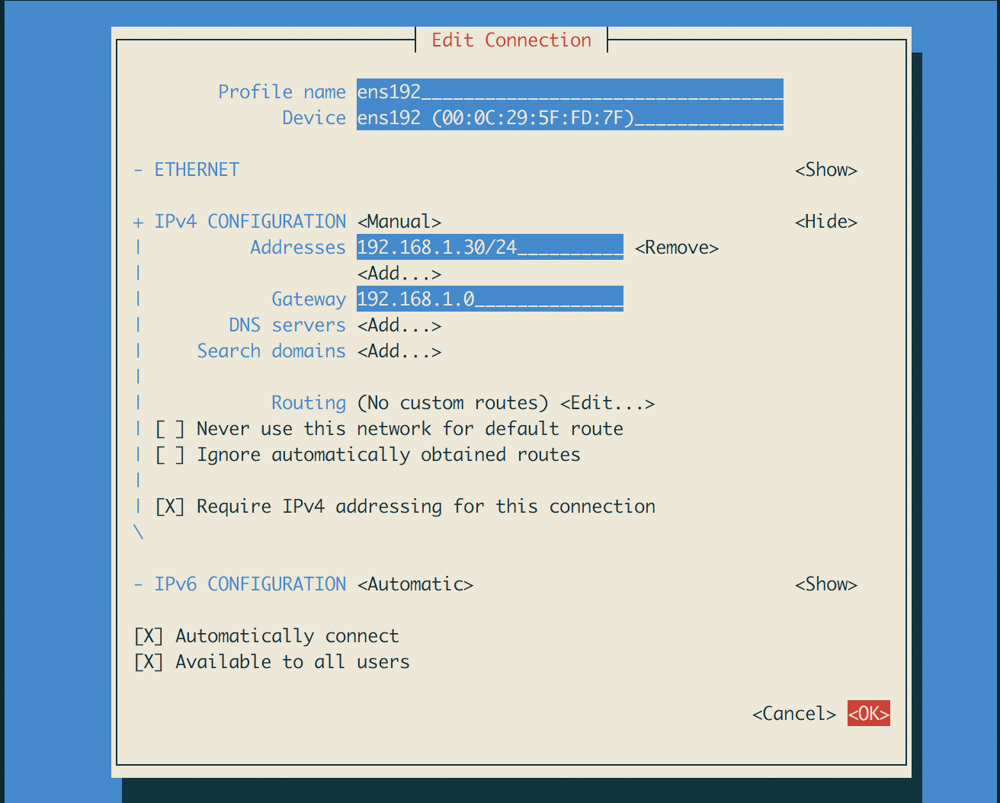
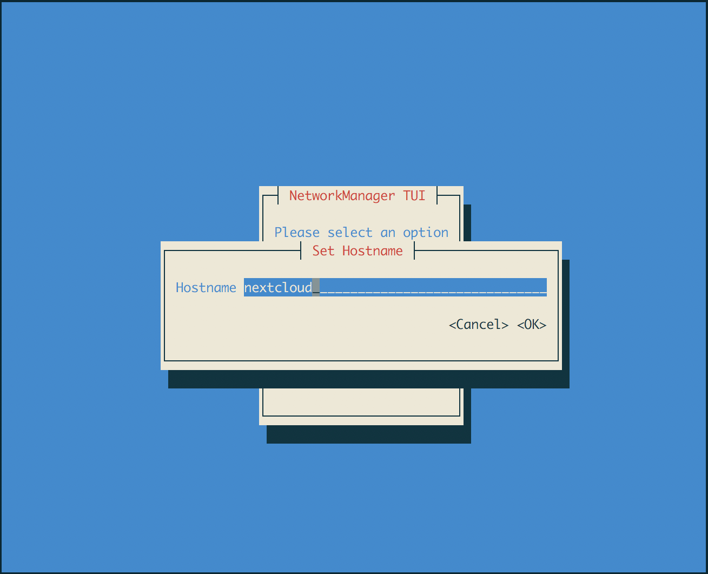

# CentOS 7 installation
Here we'll install CentOS 7 Linux to a virtual machine on the ESXi host.

## Download CentOS 7 minimal
Go to [https://www.centos.org/download/] and download the Minimal ISO image.

Log in to the ESXi Web Client by going to the server management IP address on your browser and transfer the .iso file to the server datastore.

## Create VM
Click "Create/Register VM".

Select "Create new virtual machine" and click Next.

Give the VM a name, for example "Nextcloud". Select compatibility "ESXi 6.5 virtual machine", Guest OS family "Linux" and Guest OS version "CentOS 7 (64-bit)" and click next.

Select the storage where you want to store the virtual machine files.

On the Customize settings tab allocate the resources to the VM, here are some possible values:

- CPU: 2
- Memory: 6 GB
- Hard disk 1: Thin provision, 40 GB
- Hard disk data: Thin provision, 1.5 TB
- Hard disk backup: Thin provision, 2 TB

Click Next, verify that the settings are correct and click Finish.

## Installation
Click the newly created VM and click "Power on". The VM should boot from the CentOS .iso image. Select to install CentOS.

Select the installation language.

Under System select the installation destination 

Reboot when prompted.

## Connect to the VM
When the VM has rebooted use your newly created credentials to log in and type command
```
ip addr
```
This will print out the network configuration. The output can be something like this:
```
1: lo: <LOOPBACK,UP,LOWER_UP> mtu 65536 qdisc noqueue state UNKNOWN qlen 1
    link/loopback 00:00:00:00:00:00 brd 00:00:00:00:00:00
    inet 127.0.0.1/8 scope host lo
       valid_lft forever preferred_lft forever
    inet6 ::1/128 scope host 
       valid_lft forever preferred_lft forever
2: ens192: <BROADCAST,MULTICAST,UP,LOWER_UP> mtu 1500 qdisc mq state UP qlen 1000
    link/ether 00:0c:29:5f:fd:7f brd ff:ff:ff:ff:ff:ff
    inet 192.168.1.90/24 brd 192.168.1.255 scope global dynamic ens192
       valid_lft 85879sec preferred_lft 85879sec
    inet6 fe80::885f:a458:1f7:e126/64 scope link 
       valid_lft forever preferred_lft forever
```
The first entry is the local loopback interface and the second one is the actual outside connection. Check the ip address next to `inet` and remember it, in this case it is `192.168.1.90`.

The online console is not very pleasant to work with so let's close it and connect to the server through SSH. On Windows you can download PuTTY [http://www.putty.org/] and on Mac or Linux you can use the terminal app and type `ssh 192.168.1.90` (replace the ip address with the one from your server). Accept the certificate and type in your credentials. If you can't connect make sure that you are connected to the same network as the server.

## Configure the server
Now that you can log in to the server let's make the required configurations.

### Text editor
We will need a text editor to modify text files on the server. CentOS comes with the `vi` editor installed by default but we can install the `vim` editor
```
# sudo yum -y install vim
```
or `nano`:
```
# sudo yum -y install nano
```
Vim will be used by default in the rest of the tutorial, so you'll need to substitute it with your editor of choice if you chose something else.

### Open VMware Tools
Next we install the Open VMware Tools so that we can see more detailed information on the vSphere Web Client about the state of the machine:
```
# sudo yum -y install open-vm-tools
```
After successfull installation reboot the server:
```
# sudo reboot
```
Log in to the vSphere Web Client and you should be able to see more detailed information about the VM such as the ip addresses and storage details. It may take some time before this information becomes visible.

### Hard disks
Next we will mount the data hard drives so that we can use them later for storing the Nextcloud installation and backup data so log in again with ssh.

First we will need to find the hard drives with the command:
```
# sudo fdisk -l
```
The output will be similar to this:
```
Disk /dev/sda: 42.9 GB, 42949672960 bytes, 83886080 sectors
Units = sectors of 1 * 512 = 512 bytes
Sector size (logical/physical): 512 bytes / 512 bytes
I/O size (minimum/optimal): 512 bytes / 512 bytes
Disk label type: dos
Disk identifier: 0x0007b048

   Device Boot      Start         End      Blocks   Id  System
/dev/sda1   *        2048     2099199     1048576   83  Linux
/dev/sda2         2099200    83886079    40893440   8e  Linux LVM

Disk /dev/sdb: 1649.3 GB, 1649267441664 bytes, 3221225472 sectors
Units = sectors of 1 * 512 = 512 bytes
Sector size (logical/physical): 512 bytes / 512 bytes
I/O size (minimum/optimal): 512 bytes / 512 bytes


Disk /dev/sdc: 2199.0 GB, 2199023255552 bytes, 4294967296 sectors
Units = sectors of 1 * 512 = 512 bytes
Sector size (logical/physical): 512 bytes / 512 bytes
I/O size (minimum/optimal): 512 bytes / 512 bytes


Disk /dev/mapper/centos-root: 37.6 GB, 37576769536 bytes, 73392128 sectors
Units = sectors of 1 * 512 = 512 bytes
Sector size (logical/physical): 512 bytes / 512 bytes
I/O size (minimum/optimal): 512 bytes / 512 bytes


Disk /dev/mapper/centos-swap: 4294 MB, 4294967296 bytes, 8388608 sectors
Units = sectors of 1 * 512 = 512 bytes
Sector size (logical/physical): 512 bytes / 512 bytes
I/O size (minimum/optimal): 512 bytes / 512 bytes
```
We see that the disk `/dev/sda` (42.9 GB) is the installation disk of our VM and there are two unpartitioned disks `/dev/sdb` (1649.3 GB) and `/dev/sdc` (2199.0 GB).

#### Partitioning
Next we need to create partitions for each of the unpartitioned disks so that we can mount them as folders. We will use the `fdisk` utility for this:
```
# sudo fdisk /dev/sdb
```
The `fdisk` utility will start with the following output:
```
Welcome to fdisk (util-linux 2.23.2).

Changes will remain in memory only, until you decide to write them.
Be careful before using the write command.

Device does not contain a recognized partition table
Building a new DOS disklabel with disk identifier 0x8db8dc0c.

Command (m for help): 
```
Check the current partitions with the `p` command:
```
Command (m for help): p 

Disk /dev/sdb: 1649.3 GB, 1649267441664 bytes, 3221225472 sectors
Units = sectors of 1 * 512 = 512 bytes
Sector size (logical/physical): 512 bytes / 512 bytes
I/O size (minimum/optimal): 512 bytes / 512 bytes
Disk label type: dos
Disk identifier: 0x8db8dc0c

   Device Boot      Start         End      Blocks   Id  System
```
There should be no partitions as it is a new disk. Next, give the command `n` to create a new partition and then `p` to create a primary partition. For the rest of the options press <kbd>Enter</kbd> to use the default values.
```
Command (m for help): n
Partition type:
   p   primary (0 primary, 0 extended, 4 free)
   e   extended
Select (default p): p
Partition number (1-4, default 1): 
First sector (2048-3221225471, default 2048): 
Using default value 2048
Last sector, +sectors or +size{K,M,G} (2048-3221225471, default 3221225471): 
Using default value 3221225471
Partition 1 of type Linux and of size 1.5 TiB is set
```
Finally we write the changes to the disk with the `w` command:
```
Command (m for help): w
The partition table has been altered!

Calling ioctl() to re-read partition table.
Syncing disks.
```
If we now do `sudo fdisk -l` we see that a partition has been created to the `/dev/sdb` disk:
```
...

Disk /dev/sdb: 1649.3 GB, 1649267441664 bytes, 3221225472 sectors
Units = sectors of 1 * 512 = 512 bytes
Sector size (logical/physical): 512 bytes / 512 bytes
I/O size (minimum/optimal): 512 bytes / 512 bytes
Disk label type: dos
Disk identifier: 0x8db8dc0c

   Device Boot      Start         End      Blocks   Id  System
/dev/sdb1            2048  3221225471  1610611712   83  Linux

...
```
Repeat the same steps for `/dev/sdc`.

#### Create file system
New we will create file systems for the partitions. We will be using the xfs format. To create the file system use the command (note the number 1):
```
# sudo mkfs.xfs /dev/sdb1
```
This will take a minute or two. Repeat for `/dev/sdc1`.

#### Mount the partitions
To mount the file systems we need to create new directories as mounting points and then use the `mount` command. We want to mount the smaller file system under `/mnt/data` and the larger file system under `/mnt/backup`. Let's create the directories first:
```
# sudo mkdir /mnt/data
# sudo mkdir /mnt/backup
```
Then write `sudo vim /etc/fstab` (or `sudo nano /etc/fstab` if you chose Nano as your editor) to open the `/etc/fstab` file for editing. This file is used by the system to mount file systems automatically. Add the following lines to the end of the file and save:
```
/dev/sdb1		/mnt/data		xfs	defaults	 0 0
/dev/sdc1		/mnt/backup		xfs	defaults	 0 0
```
Do an automatic mount with:
```
# sudo mount -a
```
Check that mounting was successful:
```
# mount | grep /mnt
/dev/sdb1 on /mnt/data type xfs (rw,relatime,seclabel,attr2,inode64,noquota)
/dev/sdc1 on /mnt/backup type xfs (rw,relatime,seclabel,attr2,inode64,noquota)
```
Both mounted folders should be listed here.

## Network configuration
For now the shell prompt has shown `user@localhost` for each line. To make it more clear that we are on the Nextcloud server machine let's change the hostname to reflect this:
```
# sudo hostnamectl set-hostname nextcloud
# sudo systemctl restart systemd-hostnamed
```
Now the command prompt should have the form `user@nextcloud`.

Next, let's set up a static ip address to the server. This will prevent the ip address from changing so we can always use the same address to connect to the server. We'll use the `nmtui` program:
```
# sudo nmtui
```
The following UI opens:


Select edit connection.


Select the existing Ethernet connection.



Change the IPv4 configuration to manual and add your desired IP address. Don't forget to add the netmask at the end of the address, for home routers you should typically use `/24` (255 possible addresses).



You can also set the server hostname so that you can easily differentiate on which machine you are logged when using SSH.

Quit the program and restart networking:
```
# systemctl restart network.service 
```

You will lose connection to the server so you will have to make a new SSH connection to the new IP address. Notice how the prompt has changed to show the new hostname (`user@nextcloud`).
